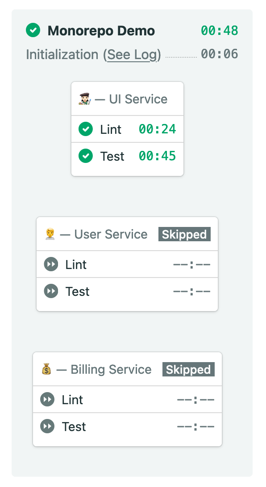

# Semaphore demo CI pipeline for Monorepo projects

Example application and continuous integration (CI) pipeline showing how to
run a Monorepo project on [Semaphore][semaphore].

## CI on Semaphore

Fork this repository and use it to [create your own project][create-project] on
Semaphore.

The CI pipeline will look like this:

The example pipeline contains 3 blocks.

1. A block that builds an Elixir based UI/Web application.
2. A block that builds a Ruby based Account management service.
3. A block that builds a Go based Billing system.

Blocks are executed only if there are [changes in][change-in] the particular
services.

Read more about [monorepo support on Semaphore][monorepo].

## Running the services

After building each service, you may start all of them with: `./start.sh`

## License

Copyright (c) 2021 Rendered Text

Distributed under the MIT License. See the file LICENSE.

[semaphore]: https://semaphoreci.com
[create-project]: https://docs.semaphoreci.com/article/63-your-first-project
[change-in]: https://docs.semaphoreci.com/reference/conditions-reference/#change_in
[monorepo]: https://docs.semaphoreci.com/essentials/building-monorepo-projects/
